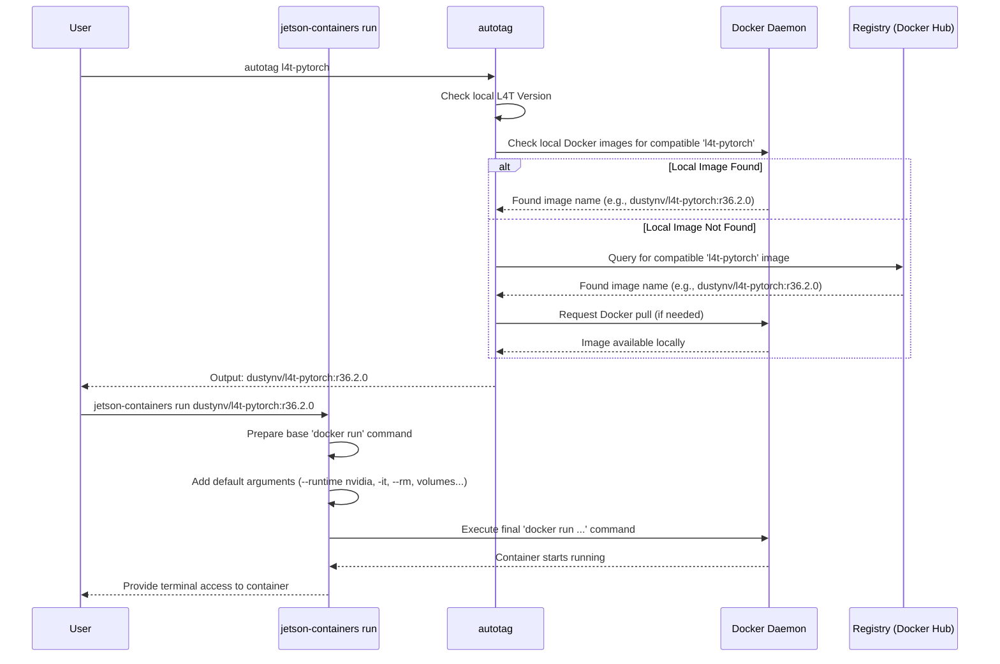

# Chapter 1: Helper Scripts (`jetson-containers` command)

Welcome to the `jetson-containers` project! If you're new to working with containers (like Docker) on NVIDIA Jetson devices, you're in the right place. This project makes it much easier to get powerful AI and robotics software running.

Let's start with a common task: imagine you want to run PyTorch, a popular AI framework, on your Jetson. Normally, using Docker (the technology behind containers), you'd need to type a long and complicated command in your terminal, something like:

```bash
sudo docker run --runtime nvidia -it --rm --network=host --volume /tmp/argus_socket:/tmp/argus_socket --volume /etc/enctune.conf:/etc/enctune.conf --volume /etc/nv_tegra_release:/etc/nv_tegra_release --volume /tmp/nv_jetson_model:/tmp/nv_jetson_model --device /dev/snd --device /dev/bus/usb -e DISPLAY=$DISPLAY --volume /tmp/.X11-unix/:/tmp/.X11-unix dustynv/l4t-pytorch:r36.2.0
```

Wow, that's a mouthful! Remembering all those `--runtime`, `--volume`, `--device` options is tricky, and it's easy to make a mistake. What if there was a simpler way?

That's exactly what the `jetson-containers` helper scripts provide!

## What are Helper Scripts? Meet `jetson-containers`

Think of the `jetson-containers` command as your friendly assistant or a set of power tools for working with containers on Jetson. Instead of wrestling with the raw `docker` commands directly, you use simple `jetson-containers` commands.

The main command is `jetson-containers`. It has sub-commands like:

*   `jetson-containers build ...`: To build container images.
*   `jetson-containers run ...`: To run container images.

These scripts act as **wrappers**. They take your simple command and, behind the scenes, translate it into the complex `docker` command with all the necessary settings already included (like enabling GPU access with `--runtime nvidia`, mounting useful folders, etc.).

**Analogy:** Imagine you need to assemble furniture. You *could* use a manual screwdriver for every single screw (like using raw `docker` commands). Or, you could use a power drill (like `jetson-containers`) – it does the same job but makes it much faster and easier!

## Using the Helper Scripts: Running PyTorch

Let's go back to our goal: running PyTorch. With the helper scripts, it becomes much simpler.

First, there's a handy tool called `autotag`. It automatically figures out the *exact* version of the container image you need based on the software version (JetPack/L4T) running on your Jetson.

You combine `autotag` with `jetson-containers run` like this:

```bash
jetson-containers run $(autotag l4t-pytorch)
```

Let's break this down:

1.  **`autotag l4t-pytorch`**: This part runs first.
    *   It checks your Jetson's system version (L4T).
    *   It looks for a pre-built `l4t-pytorch` container image that matches your system, either one you already have locally or one available online (in a container registry).
    *   It outputs the full name of the compatible image, like `dustynv/l4t-pytorch:r36.2.0`.
2.  **`jetson-containers run ...`**: This command takes the image name provided by `autotag`.
    *   It automatically constructs the correct `docker run` command.
    *   It adds essential options like `--runtime nvidia` (to let the container use the Jetson GPU), `-it` (for an interactive terminal), `--rm` (to clean up the container when you exit), and mounts some useful directories.
    *   It then executes the command, starting the PyTorch container.

**Output:** You'll see some messages as it potentially downloads the container image, and then you'll be dropped into the command prompt *inside* the running container, ready to use PyTorch!

Compare this one simple line to the long `docker run` command we saw earlier. Much easier, right?

## Using the Helper Scripts: Building a Custom Container

What if you want to create your own container image? For example, maybe you need a container that has *both* PyTorch and the Transformers library (for natural language processing).

Instead of writing a complex Dockerfile manually and figuring out all the build steps, you can use `jetson-containers build`:

```bash
jetson-containers build --name=my_container pytorch transformers
```

Here's what happens:

1.  **`jetson-containers build ...`**: This command takes the list of software packages you want (`pytorch`, `transformers`).
2.  **Dependency Handling**: It understands that `transformers` likely needs `pytorch`, and `pytorch` needs a base operating system. It figures out the correct build order. We'll learn more about how packages are defined in the next chapter: [Package Definition](02_package_definition_.md).
3.  **Automatic Configuration**: It automatically includes necessary settings and arguments for building on Jetson, ensuring compatibility with your hardware and L4T version ([L4T Version Awareness](04_l4t_version_awareness_.md)).
4.  **Docker Execution**: It calls the underlying `docker build` command (potentially multiple times for different stages) with all the correct arguments.
5.  **Tagging**: Finally, it tags the resulting image with the name you specified (`my_container`).

**Output:** The script will print logs showing the build process. If successful, you'll have a new Docker image named `my_container` on your system, ready to be run using `jetson-containers run my_container`.

This saves you from the complexity of managing multi-stage builds and environment-specific configurations yourself.

## Under the Hood: How Does it Work?

You don't *need* to know the internal details to use the helper scripts, but a quick peek can help understand what's happening.

Let's trace the `jetson-containers run $(autotag l4t-pytorch)` command again:

1.  **`autotag` Execution:** The `autotag` script (related to `jetson_containers/tag.py`) runs. It checks your L4T version, looks for local Docker images, and if necessary, queries an online container registry (like Docker Hub) for a compatible `l4t-pytorch` image tag. It prints the full image name (e.g., `dustynv/l4t-pytorch:r36.2.0`).
2.  **`jetson-containers run` Execution:** The main script takes over.
    *   It parses the image name `dustynv/l4t-pytorch:r36.2.0`.
    *   It prepares a list of arguments for the `docker run` command. This includes standard arguments it *always* adds, like `--runtime nvidia`, `-it`, `--rm`, `--network host`, and volume mounts (`--volume /data:/data`, etc.). These defaults ensure the container works correctly on Jetson out-of-the-box.
    *   It combines these default arguments with the image name and any extra arguments you might have provided.
    *   Finally, it executes the complete `docker run` command using Python's `subprocess` module.

Here's a simplified diagram showing the flow:



The actual implementation involves Python scripts like `jetson_containers/build.py` (for the `build` command), `jetson_containers/container.py` (containing core logic for running, finding images), and `jetson_containers/tag.py` (related to `autotag`).

Here's a *very simplified conceptual* snippet showing how the `run` command might add default arguments:

```python
# Simplified concept for adding default arguments
# (Actual code is more complex and spread across files)

def prepare_run_command(image_name, user_provided_args):
    # Start with the basic docker command
    command = ["sudo", "docker", "run"]

    # Add arguments that are almost always needed on Jetson
    default_args = [
        "--runtime", "nvidia",  # Crucial for GPU access!
        "-it", "--rm",         # Interactive terminal, auto-cleanup
        "--network=host",      # Easy network access
        "--volume", "/data:/data" # Mount a shared data volume
        # ... many other helpful defaults ...
    ]

    # Combine defaults, the image name, and any user extras
    final_command = command + default_args + [image_name] + user_provided_args

    print(f"Will execute: {' '.join(final_command)}")
    # In reality, this command would be executed using subprocess
    # subprocess.run(final_command, check=True)

# Example usage:
# prepare_run_command("dustynv/l4t-pytorch:r36.2.0", ["python3", "my_script.py"])
```

This demonstrates the core idea: the helper script builds upon the basic `docker` command, adding necessary boilerplate so you don't have to. The real scripts handle much more, including error checking, parsing [Package Configuration](03_package_configuration_.md), and managing the [Container Build System](05_container_build_system_.md).

## Conclusion

You've learned about the `jetson-containers` helper scripts – the user-friendly power tools for managing containers on Jetson. They simplify tasks like running pre-built images (`jetson-containers run`) and building your own custom ones (`jetson-containers build`) by automatically handling complex Docker commands and configurations.

But what exactly *are* these "packages" like `pytorch` or `transformers` that we're building and running? How does `jetson-containers` know what software they contain and how to build them? That's what we'll explore in the next chapter!

**Next:** [Chapter 2: Package Definition](02_package_definition_.md)

---

Generated by [AI Codebase Knowledge Builder](https://github.com/The-Pocket/Tutorial-Codebase-Knowledge)