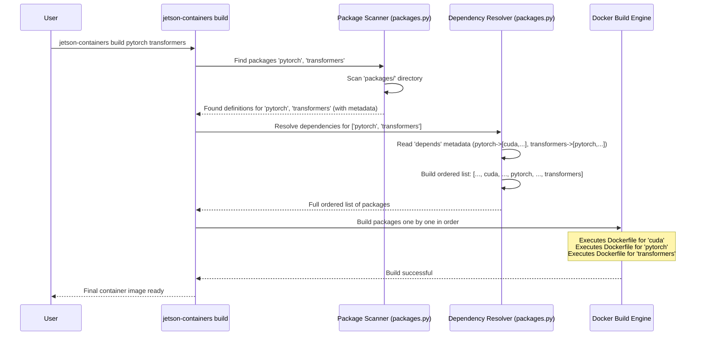

# Chapter 2: Package Definition

In [Chapter 1: Helper Scripts (`jetson-containers` command)](01_helper_scripts___jetson_containers__command__.md), we saw how the `jetson-containers` command simplifies running and building containers. We used commands like:

```bash
# To run a pre-built PyTorch container
jetson-containers run $(autotag l4t-pytorch)

# To build a custom container with PyTorch and Transformers
jetson-containers build --name=my_container pytorch transformers
```

But how does the `jetson-containers build` command know *what* "pytorch" or "transformers" means? How does it know how to install them, or that "transformers" might need "pytorch" installed first?

This is where **Package Definitions** come in. They are the blueprints that tell `jetson-containers` everything it needs to know about each piece of software.

## Motivation: Building Blocks for Software

Imagine you're building something complex with LEGOs. You don't start with a giant, single block. Instead, you have lots of smaller, standard bricks – red 2x4s, blue 1x2s, yellow roof pieces, etc. You combine these individual bricks to create your final model.

Packages in `jetson-containers` are like those LEGO bricks.

*   **Package:** A fundamental building block representing a specific piece of software (like `pytorch`, `opencv`, `ros`, `cuda`) or a set of related tools (like `build-essential`).
*   **Definition:** Each package comes with instructions and information telling the system:
    *   What software it contains.
    *   How to install that software inside a container.
    *   What other "bricks" (packages) it needs to work (its dependencies).
    *   What system version it's compatible with.

This modular approach makes it easy to:

1.  **Reuse:** Define how to install PyTorch once, then reuse that definition in many different container builds.
2.  **Combine:** Easily combine different packages (`pytorch` + `transformers` + `opencv`) by simply listing their names. The system figures out how to put them together.
3.  **Manage:** Update or modify a single package (like updating to a new PyTorch version) without having to rewrite the instructions for everything else.

## Anatomy of a Package Definition

So, what does one of these "package definitions" actually look like?

Typically, each package resides in its own folder within the `packages/` directory of the `jetson-containers` project. For example, you'll find directories like:

```
jetson-containers/
├── packages/
│   ├── pytorch/
│   │   ├── Dockerfile
│   │   ├── config.py
│   │   ├── test.py
│   │   └── ...
│   ├── opencv/
│   │   ├── Dockerfile
│   │   └── ...
│   ├── build-essential/
│   │   ├── Dockerfile
│   │   └── ...
│   └── ... (many more packages)
├── jetson_containers/
│   └── ... (helper script code)
└── ...
```

Inside a package's folder (e.g., `packages/pytorch/`), the two most important parts of its definition are usually:

1.  **`Dockerfile`:** The step-by-step recipe for installing the software.
2.  **Metadata (YAML Header or `config.py`):** Information *about* the package, like its name, dependencies, and requirements.

Let's look at these pieces.

### The `Dockerfile`: The Installation Recipe

A `Dockerfile` is a standard text file used by Docker. Think of it as a cooking recipe. It contains a series of instructions that tell Docker how to assemble a container "layer" by installing software and configuring the environment.

Here's a *simplified* snippet from the `packages/build-essential/Dockerfile` to illustrate:

```dockerfile
# --- Metadata block (more on this below) ---
# name: build-essential
# group: build
# notes: installs compilers, build tools & configures the default locale
# --- End of Metadata ---

# Use the base image provided (e.g., l4t-base)
ARG BASE_IMAGE
FROM ${BASE_IMAGE}

# Set environment variables like default language
ENV LANG=en_US.UTF-8 LC_ALL=en_US.UTF-8

# Run commands to update package lists and install software
RUN set -ex \
    && apt-get update \
    && apt-get install -y --no-install-recommends \
        build-essential \
        git \
        wget \
        curl \
    # ... (other essential tools) ...
    && apt-get clean \
    && rm -rf /var/lib/apt/lists/*
```

**Explanation:**

*   `# --- ... ---`: This special comment block at the top is a YAML header, one way to define metadata (we'll discuss it next).
*   `ARG BASE_IMAGE` / `FROM ${BASE_IMAGE}`: Specifies the starting point – usually a basic OS image or an image from a dependency package.
*   `ENV ...`: Sets environment variables inside the container.
*   `RUN ...`: Executes commands inside the container during the build process. Here, it uses `apt-get` (the Ubuntu package manager) to install tools like compilers (`build-essential`), `git`, `wget`, and `curl`.

This Dockerfile provides the core instructions for installing the `build-essential` package. The `jetson-containers` build system uses this recipe when you request this package.

### Metadata (`config.py` or YAML Header): The Blueprint Information

Just having the installation recipe (`Dockerfile`) isn't enough. The build system also needs information *about* the package:

*   What is its official name? (`name`)
*   Does it need other packages built first? (`depends`)
*   Does it have specific system requirements? (`requires`) - We'll cover this in detail in [Chapter 4: L4T Version Awareness](04_l4t_version_awareness_.md).
*   Are there any alternative names (aliases) for it? (`alias`)

This information is the package's **metadata**. It can be defined in two main ways:

1.  **YAML Header:** Inside a special comment block (`#--- ... ---`) at the top of the `Dockerfile`, as seen in the `build-essential` example above.
2.  **`config.py` file:** A separate Python script within the package directory (like `packages/pytorch/config.py`). This allows for more complex logic if needed.

Let's look at the YAML header from the `pytorch` Dockerfile (`packages/pytorch/Dockerfile`) as another example:

```dockerfile
#---
# name: pytorch         # The unique identifier for this package
# alias: torch         # An alternative name you can use
# group: pytorch       # An organizational category
# config: config.py    # Points to the Python config file for more complex settings
# depends: [cuda, cudnn, numpy, onnx] # MUST build these packages first!
# test: [test.sh, test.py]           # Scripts to verify the installation
# docs: |                            # Documentation string
#  Containers for PyTorch with CUDA support.
#  Note that the [`l4t-pytorch`](/packages/l4t/l4t-pytorch) containers also include PyTorch, `torchvision`, and `torchaudio`.
#---
ARG BASE_IMAGE
FROM ${BASE_IMAGE}

# ... rest of the PyTorch Dockerfile instructions ...
```

**Explanation:**

*   `name: pytorch`: Tells the system this package is called "pytorch".
*   `alias: torch`: You can use `jetson-containers build torch` instead of `pytorch`.
*   `depends: [cuda, cudnn, numpy, onnx]`: **Crucial!** This tells the [Container Build System](05_container_build_system_.md) that before it can build `pytorch`, it *must* first successfully build the `cuda`, `cudnn`, `numpy`, and `onnx` packages. The build system automatically figures out the correct order based on these dependencies.
*   `config: config.py`: Indicates that more configuration details are found in the `config.py` file within the same directory.

This metadata, combined with the `Dockerfile`, gives `jetson-containers` the complete definition for the `pytorch` package.

## Example Revisited: Building `pytorch transformers`

Now, let's connect this back to the command from Chapter 1:

```bash
jetson-containers build pytorch transformers
```

1.  **Package Discovery:** The `jetson-containers build` command starts by looking for package definitions named `pytorch` and `transformers` inside the `packages/` directory.
2.  **Reading Metadata:** It finds `packages/pytorch/` and `packages/llm/transformers/`. It reads their metadata (from YAML headers and/or `config.py` files).
3.  **Dependency Resolution:**
    *   It sees `pytorch` depends on `cuda`, `cudnn`, `numpy`, `onnx`.
    *   It sees `transformers` depends on `pytorch` (and potentially others like `huggingface_hub`).
    *   The [Container Build System](05_container_build_system_.md) analyzes these dependencies and determines the correct build order: `build-essential` (likely a dependency of `cuda` or `numpy`) -> `cuda` -> `cudnn` -> `numpy` -> `onnx` -> `pytorch` -> `huggingface_hub` -> `transformers`.
4.  **Executing Builds:** It then executes the `Dockerfile` instructions for each package *in that determined order*, creating intermediate container layers.
5.  **Final Image:** The result is a final container image containing all the requested packages and their dependencies, correctly installed.

## Under the Hood: Finding and Parsing Packages

How does `jetson-containers` actually find and understand all these package definitions?

The core logic resides mainly in the `jetson_containers/packages.py` script. When you run a build or other commands:

1.  **Scanning:** The script scans the directories listed in its search path (primarily `packages/*`). It looks for folders containing a `Dockerfile` or recognized configuration files (`config.py`, `.json`, `.yaml`).
2.  **Parsing:** For each potential package found, it parses the metadata (YAML header, `config.py`). It extracts the name, dependencies, requirements, Dockerfile path, etc.
3.  **Storing:** It stores this information in an internal dictionary (like a catalog) where keys are package names and values are dictionaries holding the parsed details.
4.  **Dependency Resolution:** When you request packages to build, it uses this catalog to look up the requested packages and recursively find all their dependencies using the `depends` information.
5.  **Validation:** It checks if the packages are compatible with your system using the `requires` metadata (see [Chapter 4: L4T Version Awareness](04_l4t_version_awareness_.md)).

Here's a simplified view of how the build command uses the package definitions:



Conceptually, inside `packages.py`, a package might be represented like this (simplified):

```python
# Very simplified conceptual representation of a package definition
# Actual implementation in jetson_containers/packages.py is more complex

_PACKAGES = {
    "build-essential": {
        "name": "build-essential",
        "path": "/path/to/jetson-containers/packages/build/build-essential",
        "dockerfile": "Dockerfile",
        "depends": [], # Base package, no dependencies here
        "requires": [">=32.6"], # Example L4T requirement
        "group": "build",
        # ... other metadata ...
    },
    "cuda": {
        "name": "cuda",
        "path": "/path/to/jetson-containers/packages/cuda/cuda",
        "dockerfile": "Dockerfile",
        "depends": ["build-essential"], # Depends on build-essential
        "requires": ["=11.4"], # Example CUDA version requirement
        "group": "cuda",
        # ... other metadata ...
    },
    "pytorch": {
        "name": "pytorch",
        "path": "/path/to/jetson-containers/packages/pytorch",
        "dockerfile": "Dockerfile",
        "depends": ["cuda", "cudnn", "numpy", "onnx"], # Depends on several others
        "requires": [">=35.1"],
        "alias": ["torch"],
        "group": "pytorch",
        # ... other metadata ...
    },
    # ... many more package definitions ...
}

# Functions in packages.py would then use this _PACKAGES dictionary
# to find packages, resolve dependencies, etc.
```

This internal catalog allows the helper scripts to manage the complexity of building software stacks.

## Conclusion

You've now learned about **Package Definitions** – the core organizational concept in `jetson-containers`. They are like LEGO bricks, each defining a single piece of software using:

*   A `Dockerfile` (the installation recipe).
*   Metadata (in a YAML header or `config.py`) providing name, dependencies (`depends`), and requirements (`requires`).

This modular system, managed primarily by `jetson_containers/packages.py`, allows the [Container Build System](05_container_build_system_.md) to automatically handle dependencies and build complex software stacks from simple user requests like `jetson-containers build pytorch transformers`.

But how can we customize these packages? What if we want to change a build setting or pass specific arguments to a package during the build? That's where package configuration comes in.

**Next:** [Chapter 3: Package Configuration](03_package_configuration_.md)

---

Generated by [AI Codebase Knowledge Builder](https://github.com/The-Pocket/Tutorial-Codebase-Knowledge)