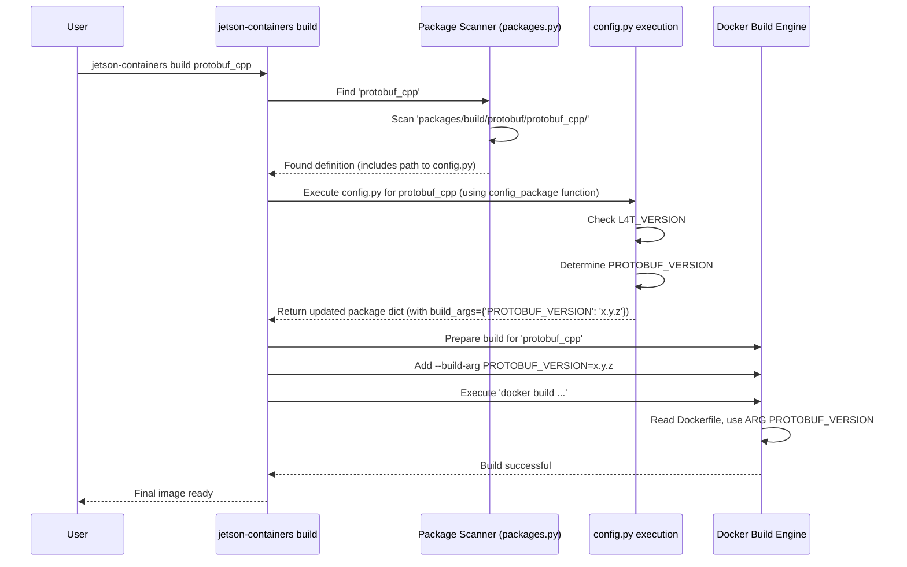

In [Chapter 2: Package Definition](02_package_definition_.md), we learned that packages are like LEGO bricks, each with a `Dockerfile` (recipe) and metadata (information like name and dependencies). This allows us to easily combine packages like `pytorch` and `transformers`.

But what if the standard recipe isn't exactly what you need? Imagine your LEGO set came with standard instructions, but also included a page with "Optional Steps" or "Expert Modifications". Maybe you want to use different colored bricks, or build a slightly different version of the model.

That's where **Package Configuration** comes in. It's the mechanism that lets you customize *how* a package is built.

## Motivation: Customizing the Build

Let's consider a simple use case. The `protobuf` package provides tools for working with Google's Protocol Buffers, a common data format. The `jetson-containers` project has a package definition for it (`packages/build/protobuf/protobuf_cpp/`).

But, different versions of NVIDIA JetPack (the Jetson software stack) work best with different versions of `protobuf`. How can the `protobuf_cpp` package definition be smart enough to install the *correct* version depending on the Jetson system it's being built on? We need a way to configure the build process dynamically.

This is just one example. You might also want to:

*   Enable or disable optional features within a package (e.g., build OpenCV with or without CUDA support).
*   Pass specific compiler flags.
*   Define tests that should be run after the build to ensure it worked correctly.

Package Configuration provides the way to specify these details.

## What is Package Configuration? The Instruction Sheet Details

Think back to the LEGO analogy. The [Package Definition](02_package_definition_.md) gives you the basic parts list (`Dockerfile`) and tells you which other sets you need first (`depends`). Package Configuration is like the detailed notes on the instruction sheet:

*   **Dependencies (`depends`):** Which other packages (LEGO sets) must be built first. (We saw this in Chapter 2, but it's technically part of the configuration).
*   **Build Arguments (`build_args`):** Custom settings passed into the build process. Like telling the LEGO assembler "use the red bricks for this part, not the blue ones" or "build version 3.20.1 specifically".
*   **Version Requirements (`requires`):** Specifies compatibility, like needing a particular JetPack/L4T version. (We'll dive deep into this in [Chapter 4: L4T Version Awareness](04_l4t_version_awareness_.md)).
*   **Tests (`test`):** Specifies scripts to run after building to check if the package works correctly. Like shaking the finished LEGO model to see if any pieces fall off.

This configuration information tells the [Container Build System](05_container_build_system_.md) precisely how to handle the package.

## Defining Configuration: YAML Header vs. `config.py`

There are two main places where this configuration information lives:

1.  **YAML Header in `Dockerfile`:**
    *   This is a special comment block at the very top of the `Dockerfile`, marked with `#---`.
    *   It uses YAML format (a simple text format) to define static details.
    *   **Best for:** Simple, unchanging information like the package `name`, basic `depends`, or simple `requires`.

    ```dockerfile
    #---
    # name: my-simple-package  # Static name
    # depends: [build-essential] # Static dependency
    # requires: '>=35.1'      # Static L4T requirement
    #---
    ARG BASE_IMAGE
    FROM ${BASE_IMAGE}

    # ... rest of Dockerfile ...
    ```
    *Explanation:* This YAML header defines the name, a dependency, and a requirement. It's clear and easy to read for basic metadata.

2.  **`config.py` File:**
    *   A Python script located inside the package's directory (e.g., `packages/build/protobuf/protobuf_cpp/config.py`).
    *   It allows you to write Python code to determine the configuration *dynamically*.
    *   **Best for:** Complex logic, setting configurations based on the system environment (like L4T version), defining many build arguments, or choosing between different build options.

## Using Configuration: The `config.py` Example

Let's solve our `protobuf_cpp` use case: installing the correct version based on the JetPack/L4T version. This requires dynamic logic, so it uses a `config.py` file.

Here's a *simplified* version of `packages/build/protobuf/protobuf_cpp/config.py`:

```python
# Simplified from packages/build/protobuf/protobuf_cpp/config.py
from jetson_containers import L4T_VERSION # Import helper to get JetPack version

# Determine the correct protobuf version based on L4T
if L4T_VERSION.major >= 35:   # JetPack 5.x
    PROTOBUF_VERSION = '3.20.3'
elif L4T_VERSION.major == 34:  # JetPack 5.0 / 5.0.1
    PROTOBUF_VERSION = '3.20.1'
else:                         # JetPack 4.x
    PROTOBUF_VERSION = '3.19.4'

# 'package' is a special dictionary available in config.py
# Add the determined version as a build argument
package['build_args'] = {
    'PROTOBUF_VERSION': PROTOBUF_VERSION,
}

# The script implicitly returns the modified 'package' dictionary
```

**Explanation:**

1.  **`from jetson_containers import L4T_VERSION`**: It imports a variable `L4T_VERSION` which holds the JetPack/L4T version of the system where the build command is being run. (More on this in [Chapter 4: L4T Version Awareness](04_l4t_version_awareness_.md)).
2.  **`if L4T_VERSION.major >= 35:`**: It checks the major version number of L4T.
3.  **`PROTOBUF_VERSION = '...'`**: Based on the L4T version, it assigns a specific version string to the `PROTOBUF_VERSION` variable.
4.  **`package['build_args'] = { ... }`**: This is the key part! It updates a special dictionary named `package` (which represents the package being configured). It adds an entry to `build_args`, creating a build argument named `PROTOBUF_VERSION` and setting its value to the version string we just determined.

Now, how does the `Dockerfile` use this argument? Let's look at a simplified snippet from `packages/build/protobuf/protobuf_cpp/Dockerfile`:

```dockerfile
# Simplified from packages/build/protobuf/protobuf_cpp/Dockerfile

# Declare the build argument we expect to receive
ARG PROTOBUF_VERSION

# Use the build argument later in a command
RUN echo "Building Protobuf version ${PROTOBUF_VERSION}" && \
    wget https://github.com/protocolbuffers/protobuf/releases/download/v${PROTOBUF_VERSION}/protobuf-cpp-${PROTOBUF_VERSION}.tar.gz
    # ... commands to build protobuf using the downloaded source ...

```

**Explanation:**

1.  **`ARG PROTOBUF_VERSION`**: This line *declares* that the Dockerfile accepts a build argument named `PROTOBUF_VERSION`. Its value will be supplied by the build system.
2.  **`wget ... v${PROTOBUF_VERSION}/...`**: Later in a `RUN` command, `${PROTOBUF_VERSION}` is used. Docker substitutes this placeholder with the actual value passed via the build argument (e.g., '3.20.3').

**The Connection:**

The `config.py` script runs *before* the Docker build starts. It calculates the correct `PROTOBUF_VERSION` and puts it into the `package['build_args']` dictionary. The [Container Build System](05_container_build_system_.md) then reads this dictionary and passes `--build-arg PROTOBUF_VERSION=3.20.3` (or the appropriate version) to the `docker build` command. The `Dockerfile` receives this argument and uses it to download and build the correct version.

This `config.py` mechanism allows packages to adapt their build process based on the environment or other logic.

## Under the Hood: How Configuration is Applied

Let's trace what happens when you run `jetson-containers build protobuf_cpp`:

1.  **Package Discovery:** The `jetson-containers` script (specifically code in `jetson_containers/packages.py`) scans the `packages/` directory to find the `protobuf_cpp` definition, as described in [Chapter 2: Package Definition](02_package_definition_.md).
2.  **Metadata Loading:** It finds the package directory (`packages/build/protobuf/protobuf_cpp/`) and identifies both the `Dockerfile` and the `config.py` file. It might also parse any basic metadata from a YAML header in the `Dockerfile`.
3.  **Configuration Execution (`config.py`):** Because a `config.py` exists, the script executes it.
    *   The `config.py` script checks the `L4T_VERSION`.
    *   It determines the correct `PROTOBUF_VERSION`.
    *   It modifies the `package` dictionary in memory, adding `{'PROTOBUF_VERSION': 'x.y.z'}` to the `build_args` key.
4.  **Build Preparation:** The [Container Build System](05_container_build_system_.md) now has the complete, potentially modified, package definition for `protobuf_cpp`, including the dynamically generated `build_args`.
5.  **Docker Invocation:** The system constructs the `docker build` command. It iterates through the `build_args` dictionary from the package definition and adds `--build-arg KEY=VALUE` for each entry. For our example, it adds `--build-arg PROTOBUF_VERSION=x.y.z`.
6.  **Docker Build:** Docker executes the `Dockerfile` instructions, using the provided build arguments.

Here’s a sequence diagram illustrating this:



The core logic for handling `config.py` resides in the `config_package` function within `jetson_containers/packages.py`. Here's a conceptual peek:

```python
# Simplified concept from jetson_containers/packages.py
import importlib.util
import sys
import os

def config_package(package):
    # 'package' is a dictionary holding the initial package info

    # Check if config.py exists
    config_py_path = os.path.join(package['path'], 'config.py') # Simplified check

    if os.path.exists(config_py_path):
        try:
            # Dynamically load and run the config.py script
            module_name = f"packages.{package['name']}.config"
            spec = importlib.util.spec_from_file_location(module_name, config_py_path)
            module = importlib.util.module_from_spec(spec)

            # Make the 'package' dictionary available within the config script
            module.package = package
            sys.modules[module_name] = module

            # Execute the script!
            spec.loader.exec_module(module)

            # The script modified 'module.package', so update our reference
            package = module.package

            if package is None: # Check if the config script disabled the package
                 return []

        except Exception as e:
            print(f"Error running config.py for {package['name']}: {e}")
            # Handle error, maybe disable the package

    # Return the potentially modified package dictionary
    return [package] # Assuming single package for simplicity
```

This function dynamically loads and executes the `config.py`, allowing it to modify the `package` dictionary before the build system uses it. The build system then takes care of translating `package['build_args']` into the necessary `--build-arg` flags for Docker.

## Conclusion

Package Configuration is the key to customizing how individual software packages are built within `jetson-containers`. You can define static settings like dependencies in the `Dockerfile`'s YAML header, or use a `config.py` file for dynamic logic, such as setting specific versions or features via **build arguments** based on your system's environment.

This allows packages to be flexible and adapt to different needs and system versions. We saw how `config.py` often uses the JetPack/L4T version. But how does the system know this version, and how else is this version awareness used? Let's explore that next.

**Next:** [Chapter 4: L4T Version Awareness](04_l4t_version_awareness_.md)

---

Generated by [AI Codebase Knowledge Builder](https://github.com/The-Pocket/Tutorial-Codebase-Knowledge)