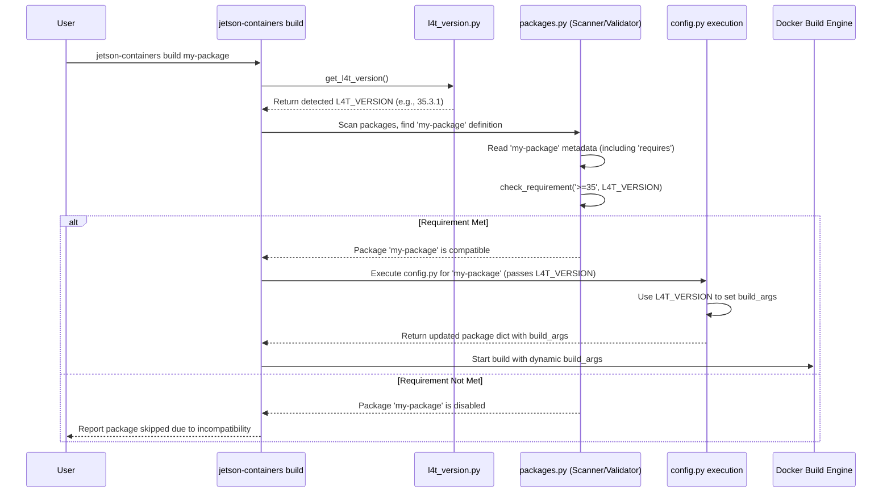

# Chapter 4: L4T Version Awareness

In [Chapter 3: Package Configuration](03_package_configuration_.md), we saw how `config.py` can be used to dynamically change how a package is built, for example, by setting build arguments based on the system environment. We used the `protobuf_cpp` package as an example, where different versions are installed based on the JetPack/L4T version.

But how does the system *know* which JetPack/L4T version is running? And how does it ensure that a package is even *compatible* with that version? This is where **L4T Version Awareness** comes into play.

## Motivation: Ensuring Compatibility (Like LEGO Bricks)

Imagine you have different types of LEGO bricks: the big Duplo blocks for toddlers and the smaller, standard LEGO bricks for older kids. They don't fit together! Trying to put a small LEGO brick onto a Duplo base won't work well.

NVIDIA Jetson devices are similar. They run specific versions of system software called **JetPack**, which includes **L4T** (Linux for Tegra). Think of these JetPack/L4T versions like the different LEGO systems (Duplo vs. standard).

*   **Older JetPacks (e.g., JetPack 4.x / L4T R32.x)** are like Duplo.
*   **Newer JetPacks (e.g., JetPack 5.x / L4T R35.x, JetPack 6.x / L4T R36.x)** are like standard LEGOs.

Software built for one version might not work correctly on another. Libraries like CUDA (for GPU computing) and cuDNN (for deep learning) have specific versions tied to each JetPack release. If you try to run a container built for JetPack 5 on a Jetson running JetPack 4, it's like trying to mix Duplo and standard LEGOs – things might break!

**The Problem:** How can `jetson-containers` automatically handle these compatibility issues? How does it make sure it only tries to build or run containers that are compatible with the Jetson device's specific L4T version?

**The Solution:** L4T Version Awareness! The system automatically:
1.  **Detects** the L4T version running on the host Jetson.
2.  **Checks** package definitions for compatibility requirements.
3.  **Selects** appropriate base images or package versions based on the detected L4T version.

## Key Concepts

### 1. L4T Version Detection

The first step is figuring out which L4T version the Jetson is actually running. `jetson-containers` does this automatically when you run commands like `build` or `run`. It looks at system files (like `/etc/nv_tegra_release`) to determine the exact version (e.g., R35.3.1, R36.2.0). This detected version is stored internally and made available for other parts of the system.

### 2. The `requires` Field

In [Chapter 2: Package Definition](02_package_definition_.md) and [Chapter 3: Package Configuration](03_package_configuration_.md), we saw metadata fields like `name` and `depends`. Another crucial field is `requires`.

Think of `requires` as a label on a LEGO box saying "Requires Standard LEGO Baseplate" or "Only works with Duplo". It tells the build system the L4T versions this package is compatible with.

It's defined in the package's metadata (either the YAML header in the `Dockerfile` or in `config.py`).

**Example (YAML Header in `Dockerfile`):**

```dockerfile
#---
# name: my-jp5-package
# requires: '>=34'   # Requires L4T R34.x (JetPack 5.0) or newer
# depends: [cuda]
#---
ARG BASE_IMAGE
FROM ${BASE_IMAGE}

# ... rest of Dockerfile ...
```

*Explanation:* The `requires: '>=34'` line means this package, `my-jp5-package`, should *only* be considered for building if the detected L4T version is R34.x.x or higher (which corresponds to JetPack 5 and newer). If you try to build this on a Jetson running L4T R32.x (JetPack 4), the build system will automatically skip this package because the requirement isn't met.

You can specify exact versions (`==35.3.1`), ranges (`>=35`, `<36`), or multiple conditions.

### 3. The `L4T_VERSION` Variable in `config.py`

While `requires` is great for filtering out incompatible packages entirely, sometimes a package *is* compatible with multiple L4T versions, but it needs to be built slightly differently for each. This is where the `config.py` script and the special `L4T_VERSION` variable come in.

As we saw in [Chapter 3: Package Configuration](03_package_configuration_.md), the `config.py` script can access the detected L4T version.

**Example (`config.py` for `protobuf_cpp` - Simplified):**

```python
# Simplified from packages/build/protobuf/protobuf_cpp/config.py
from jetson_containers import L4T_VERSION # Import the detected L4T version

# Decide which protobuf version to use based on L4T
if L4T_VERSION.major >= 35:   # L4T R35+ (JetPack 5.x)
    PROTOBUF_VERSION = '3.20.3'
elif L4T_VERSION.major == 34:  # L4T R34.x (JetPack 5.0 / 5.0.1)
    PROTOBUF_VERSION = '3.20.1'
else:                         # L4T R32.x (JetPack 4.x)
    PROTOBUF_VERSION = '3.19.4'

# Set the build argument for the Dockerfile
package['build_args'] = {
    'PROTOBUF_VERSION': PROTOBUF_VERSION,
}
```

*Explanation:* This script uses the imported `L4T_VERSION` object (which holds the detected version like `35.3.1`) to choose the correct `PROTOBUF_VERSION` string. It then sets a build argument, allowing the `Dockerfile` to install the version specific to the host's L4T.

## How it Works: Solving the Use Case

Let's revisit the `protobuf_cpp` example and see how L4T Version Awareness ensures the correct version is built:

1.  **Command:** You run `jetson-containers build protobuf_cpp` on your Jetson (let's say it's running L4T R35.3.1 / JetPack 5.1.1).
2.  **L4T Detection:** The system detects `L4T_VERSION` as `35.3.1`.
3.  **Package Discovery:** It finds the `protobuf_cpp` package definition.
4.  **`requires` Check:** It checks the `protobuf_cpp` package's `requires` field (if any). Let's assume it allows R35.3.1, so the package is considered valid.
5.  **`config.py` Execution:** It runs the `packages/build/protobuf/protobuf_cpp/config.py` script.
6.  **Dynamic Configuration:** Inside `config.py`:
    *   The `L4T_VERSION` variable holds `35.3.1`.
    *   The `if L4T_VERSION.major >= 35:` condition evaluates to `True`.
    *   `PROTOBUF_VERSION` is set to `'3.20.3'`.
    *   The `package['build_args']` dictionary is updated to `{'PROTOBUF_VERSION': '3.20.3'}`.
7.  **Build Execution:** The [Container Build System](05_container_build_system_.md) starts the Docker build for `protobuf_cpp`, passing `--build-arg PROTOBUF_VERSION=3.20.3` to Docker.
8.  **Dockerfile:** The `Dockerfile` uses the `PROTOBUF_VERSION` argument to download and install version 3.20.3.

**Result:** The container gets built with the `protobuf` version specifically compatible with your JetPack 5 system, thanks to the L4T version awareness features. If you had run the same command on a JetPack 4 system (L4T R32.x), the `else` block in `config.py` would have triggered, setting `PROTOBUF_VERSION` to `'3.19.4'` instead.

## Under the Hood: Implementation Details

How does this detection and checking actually happen?

**1. Detecting L4T Version:**
   - The primary logic for detecting the L4T version resides in `jetson_containers/l4t_version.py`.
   - The `get_l4t_version()` function is called early in the process.
   - It tries to read the `/etc/nv_tegra_release` file on the Jetson.
   - It parses the text in that file (e.g., `# R35 (release), REVISION: 3.1, ...`) to extract the major, minor, and micro version numbers.
   - It returns a `packaging.version.Version` object (like `Version('35.3.1')`) which is easy to compare.

   ```python
   # Simplified concept from jetson_containers/l4t_version.py
   from packaging.version import Version
   import os
   import re # For text searching

   def get_l4t_version(version_file='/etc/nv_tegra_release'):
       if 'L4T_VERSION' in os.environ: # Check environment variable override first
           return Version(os.environ['L4T_VERSION'])

       if not os.path.isfile(version_file):
           # Handle cases where the file doesn't exist (e.g., running on x86)
           # For simplicity, let's pretend it returns a default for non-Jetson
           print(f"Warning: {version_file} not found.")
           return Version('0.0.0') # Or some default/indicator

       try:
           with open(version_file) as file:
               line = file.readline()
               # Example line: # R35 (release), REVISION: 3.1, ...
               match = re.search(r"R(\d+).*REVISION: (\d+\.\d+)", line)
               if match:
                   release = match.group(1)
                   revision = match.group(2)
                   return Version(f'{release}.{revision}')
       except Exception as e:
           print(f"Error parsing {version_file}: {e}")

       # Fallback if parsing fails
       return Version('0.0.0')

   # This L4T_VERSION is imported and used elsewhere
   L4T_VERSION = get_l4t_version()
   print(f"Detected L4T Version: {L4T_VERSION}")
   ```

**2. Checking `requires`:**
   - This happens within the package scanning and validation logic in `jetson_containers/packages.py`.
   - When scanning packages (using `scan_packages`), after loading the metadata (including the `requires` field), the `validate_package` function is called.
   - Inside `validate_package`, it iterates through the requirements listed in the `requires` field for each package.
   - For each requirement (e.g., `>=34`, `==35.3.1`), it calls the `check_requirement` function.
   - `check_requirement` compares the requirement string against the globally detected `L4T_VERSION` (imported from `l4t_version.py`) using standard version comparison logic (provided by the `packaging` library).
   - If *any* requirement in the `requires` list is not met, the package is marked as `disabled` and effectively removed from the list of packages to be built or considered.

   ```python
   # Simplified concept from jetson_containers/packages.py
   from packaging.specifiers import SpecifierSet
   from .l4t_version import L4T_VERSION # Import the detected version

   def check_requirement(requires_spec, l4t_version=L4T_VERSION):
       """Checks if the detected L4T version meets a specific requirement."""
       try:
           # Use SpecifierSet for powerful version comparisons (e.g., '>=34', '==35.3.1')
           spec = SpecifierSet(requires_spec.replace('r', '')) # Remove 'r' if present
           return l4t_version in spec
       except Exception as e:
           print(f"Warning: Invalid requirement specifier '{requires_spec}': {e}")
           return False # Treat invalid specifiers as unmet

   def validate_package(package):
       """Checks requirements and marks incompatible packages as disabled."""
       # ... (other validation logic) ...

       requirements_met = True
       if 'requires' in package:
           # Ensure 'requires' is a list
           if isinstance(package['requires'], str):
               package['requires'] = [package['requires']]

           # Check each requirement
           for req in package['requires']:
               if not check_requirement(req):
                   print(f"Package '{package.get('name', 'Unknown')}' requirement '{req}' not met by L4T {L4T_VERSION}.")
                   requirements_met = False
                   break # No need to check further requirements

       if not requirements_met:
           package['disabled'] = True
           print(f"--> Disabling package '{package.get('name', 'Unknown')}' due to unmet requirements.")

       # ... (handle disabled packages) ...
       return [package] if not package.get('disabled', False) else []
   ```

**Sequence Diagram:**

Here's a simplified view of how a build command uses L4T awareness:



This combination of automatic detection, the `requires` check for filtering, and the `L4T_VERSION` variable in `config.py` for dynamic configuration provides robust L4T version awareness.

## Conclusion

You've learned how `jetson-containers` handles the critical challenge of software compatibility across different NVIDIA Jetson JetPack/L4T versions. This **L4T Version Awareness** works like a compatibility checker for LEGOs:

*   It **detects** the host's L4T version (using `jetson_containers/l4t_version.py`).
*   It uses the **`requires`** field in package metadata to automatically filter out incompatible packages (checked by `jetson_containers/packages.py`).
*   It provides the detected **`L4T_VERSION`** variable to `config.py` scripts, allowing packages to dynamically adjust their build process (like installing specific versions) based on the host system.

This ensures that the containers you build or run are tailored to your specific Jetson environment, preventing errors caused by version mismatches.

Now that we understand packages, configuration, and version awareness, let's look at the engine that puts it all together: the build system itself.

**Next:** [Chapter 5: Container Build System](05_container_build_system_.md)

---

Generated by [AI Codebase Knowledge Builder](https://github.com/The-Pocket/Tutorial-Codebase-Knowledge)