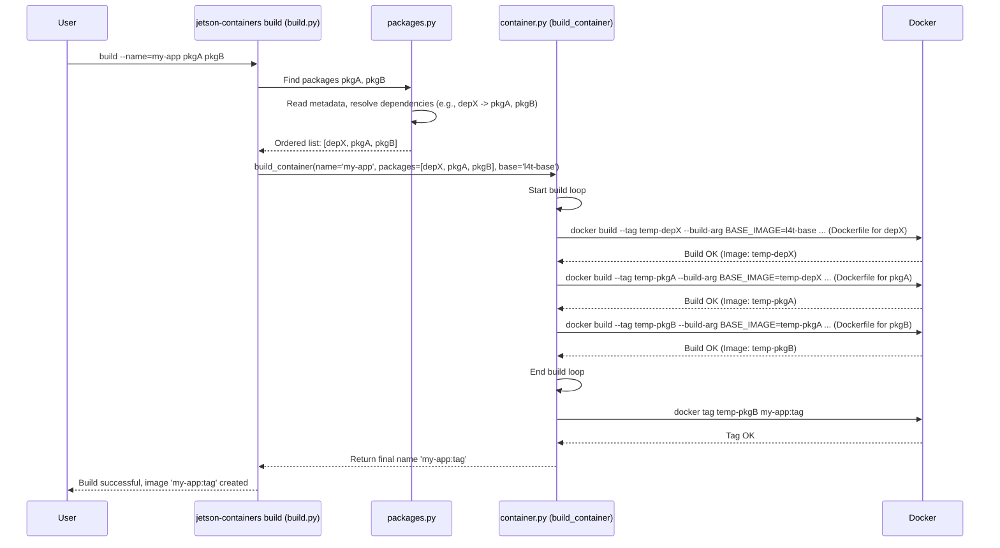

In the previous chapter, [Chapter 4: L4T Version Awareness](04_l4t_version_awareness_.md), we saw how `jetson-containers` ensures that packages are compatible with your Jetson's specific software version (L4T). It checks requirements and even allows packages to adjust their build steps using `config.py`.

Now, let's zoom out and look at the big picture. We know about individual packages ([Chapter 2: Package Definition](02_package_definition_.md)) and how to customize them ([Chapter 3: Package Configuration](03_package_configuration_.md)). But what actually takes these individual pieces and assembles the final container image?

That's the job of the **Container Build System** – the master builder of our project.

## Motivation: Assembling the Final Product

Imagine you bought several LEGO kits: a car kit, a house kit, and a tree kit. You want to combine them all onto one big baseplate to create a scene. You can't just dump all the pieces together! You need a plan:

1.  Maybe the car needs some basic road pieces built first (a dependency).
2.  You need to build the house *before* you place the tree next to it.
3.  You need someone (or a process) to follow the instructions for each kit *in the right order* and carefully attach them to the baseplate.

In `jetson-containers`, when you run a command like:

```bash
jetson-containers build --name=my-ai-app pytorch opencv ros-base
```

You're asking for a "scene" (a container image) that includes PyTorch, OpenCV, and ROS (Robot Operating System). These are our "LEGO kits". The Container Build System is the master builder who figures out how to assemble them.

**The Problem:** How does the system take your list of desired software (`pytorch`, `opencv`, `ros-base`), figure out all the *hidden* requirements (like needing `cuda` for PyTorch, or `build-essential` tools), determine the correct assembly order, and execute the build steps for each piece to produce one final, working container image named `my-ai-app`?

**The Solution:** The Container Build System orchestrates this entire process. It acts like the master LEGO builder, taking the list of desired packages and managing the assembly from start to finish.

## Key Concepts of the Build System

The Container Build System performs several crucial tasks:

1.  **Package Discovery:** Finds the definition files ([Chapter 2: Package Definition](02_package_definition_.md)) for all the packages you requested.
2.  **Dependency Resolution:** Reads the `depends` metadata for each package and figures out the complete list of packages needed, including all the hidden dependencies (like `cuda`, `cudnn`, `numpy` for `pytorch`). It then calculates the correct build order, ensuring dependencies are built *before* the packages that need them. Think of this as checking the LEGO instructions to see which smaller parts need to be assembled first.
3.  **L4T Compatibility Check:** Uses [Chapter 4: L4T Version Awareness](04_l4t_version_awareness_.md) to verify that all packages in the build list are compatible with your Jetson's L4T version, skipping any that aren't.
4.  **Sequential Build Execution:** Builds the packages one by one, in the calculated dependency order. For each package:
    *   It applies any dynamic configurations from `config.py` ([Chapter 3: Package Configuration](03_package_configuration_.md)), potentially setting specific build arguments.
    *   It invokes the `docker build` command using the package's `Dockerfile`.
5.  **Layering:** Each successful package build creates a new Docker image *layer* on top of the previous one. The first package builds on a base image (like `l4t-base`), the second builds on the result of the first, the third builds on the result of the second, and so on. This stacks the software neatly.
6.  **Tagging:** Once all packages are built, it tags the final resulting image layer with the name you requested (e.g., `my-ai-app`).

## Using the Build System: The `pytorch opencv ros-base` Example

Let's trace our example command:

```bash
jetson-containers build --name=my-ai-app pytorch opencv ros-base
```

Here's how the Container Build System handles it:

1.  **Request:** The system receives the request to build `pytorch`, `opencv`, and `ros-base` into an image named `my-ai-app`.
2.  **Discovery:** It finds the package definitions for `pytorch`, `opencv`, and `ros-base` in the `packages/` directory.
3.  **Dependency Resolution:**
    *   It reads the `depends` fields:
        *   `pytorch` might depend on `cuda`, `cudnn`, `numpy`.
        *   `opencv` might depend on `cuda`, `build-essential`, `cmake`.
        *   `ros-base` might depend on `build-essential`, `python3`.
        *   These dependencies might have *their own* dependencies!
    *   The system analyzes this entire dependency graph and determines a valid build order, for example:
        `l4t-base` (starting point) -> `build-essential` -> `cmake` -> `python3` -> `cuda` -> `cudnn` -> `numpy` -> `pytorch` -> `opencv` -> `ros-base`.
4.  **Compatibility Check:** It verifies that all packages in this list meet the `requires` constraints for your detected L4T version.
5.  **Sequential Build & Layering:** The system starts building, using the output of one step as the input (`BASE_IMAGE`) for the next:
    *   Build `build-essential` using its Dockerfile on `l4t-base`. Result: Image A.
    *   Build `cmake` using its Dockerfile on Image A. Result: Image B.
    *   Build `python3` using its Dockerfile on Image B. Result: Image C.
    *   ... (continue for `cuda`, `cudnn`, `numpy`) ...
    *   Build `pytorch` using its Dockerfile (and any `config.py` args) on the previous result. Result: Image P.
    *   Build `opencv` using its Dockerfile on Image P. Result: Image O.
    *   Build `ros-base` using its Dockerfile on Image O. Result: Image R.
6.  **Tagging:** The final image (Image R) contains everything. The build system tags this final image as `my-ai-app:tag` (where `tag` includes L4T info like `r35.4.1`).

**Output:** You'll see build logs scroll by for each package being built. If everything succeeds, you'll have a new Docker image named `my-ai-app:r<L4T_VERSION>` on your system, ready to run!

```
[...]
---> Building package build-essential...
---> Building package cmake...
---> Building package python3...
---> Building package cuda...
---> Building package cudnn...
---> Building package numpy...
---> Building package pytorch...
---> Building package opencv...
---> Building package ros-base...
Successfully built image: my-ai-app:r35.4.1
```

## Under the Hood: How the Build is Orchestrated

The main logic for the build system resides in `jetson_containers/build.py` (which handles command-line arguments and calls the core functions) and `jetson_containers/container.py` (specifically the `build_container` function). The dependency resolution happens in `jetson_containers/packages.py`.

Here's a simplified step-by-step flow:

1.  **Parse Arguments:** `build.py` parses your command (`jetson-containers build --name=my-ai-app pytorch opencv ros-base`).
2.  **Find Initial Packages:** It calls functions in `packages.py` to find the definitions for `pytorch`, `opencv`, and `ros-base`.
3.  **Resolve Dependencies:** It calls `resolve_dependencies` in `packages.py`. This function recursively reads the `depends` fields of packages and builds the full, ordered list (e.g., `['build-essential', ..., 'pytorch', 'opencv', 'ros-base']`).
4.  **Call `build_container`:** The main script passes this ordered list, the desired final name (`my-ai-app`), the base image (`l4t-base` by default), and other options to the `build_container` function in `container.py`.
5.  **Build Loop:** `build_container` iterates through the ordered list of packages.
    *   For each package:
        *   It retrieves the full package definition (potentially running `config.py` via `config_package` in `packages.py` to get dynamic build args).
        *   It constructs the `docker build` command string. This includes:
            *   `--tag <intermediate_name>`: Gives each step a temporary tag.
            *   `--build-arg BASE_IMAGE=<previous_image>`: Tells Docker which image to build upon.
            *   `--build-arg KEY=VALUE`: Adds any build arguments defined in the package's `config.py` or metadata.
            *   `--file <path_to_dockerfile>`: Specifies the Dockerfile to use.
            *   The path to the package directory (build context).
        *   It executes the `docker build` command using Python's `subprocess`.
        *   If successful, it updates the `base` variable to the `<intermediate_name>` for the next iteration.
        *   It might optionally run tests specified in the package definition against the intermediate container.
6.  **Final Tag:** After the loop finishes, the last intermediate image (which contains all layers) is tagged with the final requested name (`my-ai-app:tag`).
7.  **Return:** The function returns the final image name.

**Simplified Sequence Diagram:**



**Conceptual Code Snippet (from `container.py`):**

This is a *highly simplified* illustration of the build loop inside `build_container`:

```python
# Simplified concept from jetson_containers/container.py build_container function
import subprocess
from .packages import find_package, config_package # For getting package details

def build_container(name, packages, base, build_args={}, **kwargs):
    # 'packages' is the ordered list from dependency resolution
    # 'base' is the starting image (e.g., 'l4t-base')
    # 'name' is the desired final image name

    print(f"Starting build for {name} with packages: {packages}")

    current_base_image = base

    # Loop through packages in the resolved order
    for idx, package_name in enumerate(packages):
        print(f"[{idx+1}/{len(packages)}] Building package: {package_name}")

        # 1. Get package definition (this might run config.py)
        # package_info = find_package(package_name) # Simplified lookup
        # package_info = config_package(package_info) # Apply config.py (conceptually)
        # Let's assume package_info now contains 'path', 'dockerfile', 'build_args', etc.
        package_info = find_package(package_name) # In reality, config happens elsewhere or implicitly

        intermediate_tag = f"{name}-{package_name.replace(':','_')}-temp" # Unique temp tag

        # 2. Construct the docker build command
        cmd = ["sudo", "docker", "build", "--network=host"]
        cmd.extend(["--tag", intermediate_tag])
        cmd.extend(["--file", os.path.join(package_info['path'], package_info.get('dockerfile', 'Dockerfile'))]) # Handle missing Dockerfile too
        cmd.extend(["--build-arg", f"BASE_IMAGE={current_base_image}"])

        # Add build args from package config
        pkg_build_args = package_info.get('build_args', {})
        for key, value in pkg_build_args.items():
            cmd.extend(["--build-arg", f"{key}=\"{value}\""])

        # Add command-line build args
        for key, value in build_args.items():
             cmd.extend(["--build-arg", f"{key}=\"{value}\""])

        cmd.append(package_info['path']) # Build context path

        print(f"Executing: {' '.join(cmd)}") # Show the command

        # 3. Execute the build command
        # In reality, use subprocess.run with error checking, logging, etc.
        # subprocess.run(cmd, check=True)
        print(f"--- (Simulated build for {package_name}) ---") # Placeholder for actual build

        # 4. Update the base image for the next iteration
        current_base_image = intermediate_tag

        # 5. Optionally run tests (simplified)
        # test_container(current_base_image, package_info)

    # 6. Tag the final image
    final_name = f"{name}" # Add L4T tag logic here in real code
    print(f"Tagging final image {current_base_image} as {final_name}")
    # tag_cmd = ["sudo", "docker", "tag", current_base_image, final_name]
    # subprocess.run(tag_cmd, check=True)

    print(f"Build complete! Final image: {final_name}")
    return final_name

# Example conceptual call (would be called by build.py)
# ordered_packages = ['build-essential', 'cmake', 'python3', 'cuda', 'cudnn', 'numpy', 'pytorch', 'opencv', 'ros-base']
# build_container('my-ai-app', ordered_packages, 'l4t-base')
```

This loop is the heart of the build system. It takes the resolved dependency list and turns it into a series of `docker build` commands, layering each package onto the previous one until the final image is assembled.

## Conclusion

The **Container Build System** is the engine that powers `jetson-containers build`. It acts as the master assembler, taking your requested packages and orchestrating the entire build process:

*   It resolves all dependencies using [Package Definition](02_package_definition_.md) metadata.
*   It ensures compatibility using [L4T Version Awareness](04_l4t_version_awareness_.md).
*   It applies customizations using [Package Configuration](03_package_configuration_.md).
*   It executes the builds sequentially, layering the results.
*   It produces a single, final Docker image tailored to your needs.

This system hides the complexity of multi-stage Docker builds and dependency management, letting you define your desired software stack simply by listing the package names.

Now that we can build these complex containers, how do we document what's inside them and how they were built? That's the job of the Documentation Generator.

**Next:** [Chapter 6: Documentation Generator](06_documentation_generator_.md)

---

Generated by [AI Codebase Knowledge Builder](https://github.com/The-Pocket/Tutorial-Codebase-Knowledge)