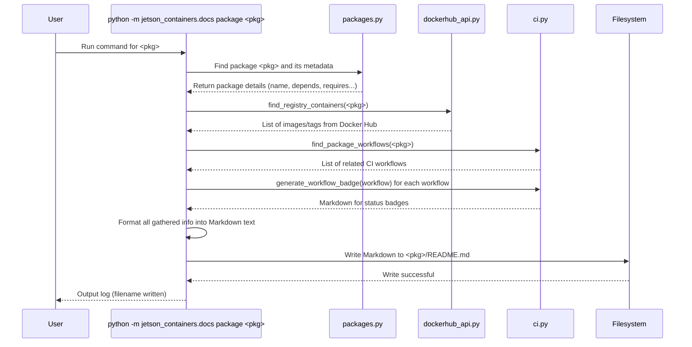

# Chapter 6: Documentation Generator

In the previous chapter, [Chapter 5: Container Build System](05_container_build_system_.md), we explored the engine that takes our package definitions and assembles the final container images. We saw how it handles dependencies and builds everything in the right order.

Now that we have these potentially complex container images built from various packages, how do we keep track of what's inside each one? How do we know which version of software it contains, what other packages it depends on, or how to build or run it? Manually writing and updating this information for every single package and the main project index would be a tedious and error-prone task.

Imagine you have a massive collection of LEGO kits. Each kit comes with a box showing the final model, listing the parts inside, and giving instructions. Now, imagine you start mixing and matching parts, creating custom builds. It would be incredibly helpful to have an automatic labeling machine that could scan your custom creation, figure out which original kits the parts came from, and print a new, accurate label for it, including updated instructions!

That's exactly what the **Documentation Generator** does for the `jetson-containers` project.

## Motivation: Keeping Docs Fresh and Accurate Automatically

Software projects change constantly. New package versions are released, dependencies are updated, and build processes evolve. If the documentation isn't updated along with the code, it quickly becomes useless or even misleading.

**The Problem:** How can we ensure the documentation for each package (and the main project) always reflects the *actual* state of the code, including:
*   Correct dependencies?
*   Up-to-date list of available container images on Docker Hub?
*   Accurate build and run commands?
*   Current build status (passing or failing)?

**The Solution:** The Documentation Generator! It's a tool within the `jetson-containers` project that automatically scans the package definitions and related information to generate consistent, up-to-date README files.

## What is the Documentation Generator?

Think of it as an automated technical writer for the project. It's a script (`jetson_containers/docs.py`) that knows how to:

1.  **Find Packages:** Locate all the package definitions ([Chapter 2: Package Definition](02_package_definition_.md)) within the `packages/` directory.
2.  **Read Metadata:** Extract information from each package's `Dockerfile` header and `config.py` ([Chapter 3: Package Configuration](03_package_configuration_.md)), such as its name, aliases, dependencies (`depends`), L4T requirements (`requires`), and any notes.
3.  **Check Docker Hub:** Query the Docker Hub container registry to find pre-built images corresponding to the package, listing available tags (like `r35.4.1`, `r36.2.0`), their creation dates, and sizes.
4.  **Check Build Status:** Look for associated CI/CD workflow files ([Chapter 7: CI/CD Workflow Generation](07_ci_cd_workflow_generation_.md)) to generate build status badges (like those little green "passing" images).
5.  **Format Output:** Assemble all this gathered information into well-structured Markdown files.

It generates two main types of documentation:

1.  **Individual Package READMEs:** Creates or updates the `README.md` file inside *each* package's directory (e.g., `packages/pytorch/README.md`).
2.  **Main Package Index:** Creates or updates the main `packages/README.md` file, which lists all available packages grouped by category, with links to their individual READMEs and their build status badges.

## What Information is Included?

Let's look at an example. The generator creates files like `packages/build/bazel/README.md`. If you open it, you'll see sections automatically generated with information like:

*   **Container Details Table:**
    *   `Builds`: Links to CI/CD build status badges.
    *   `Requires`: The L4T version compatibility (from [Chapter 4: L4T Version Awareness](04_l4t_version_awareness_.md)).
    *   `Dependencies`: Links to the READMEs of packages it depends on.
    *   `Dependants`: Links to the READMEs of packages that depend on *this* one.
    *   `Dockerfile`: A link to the package's `Dockerfile`.
    *   `Images`: Links to Docker Hub images, including tag, date pushed, and size.

    ```markdown
    # Example Snippet from a generated README's Container Details
    | **`bazel`** | |
    | :-- | :-- |
    | &nbsp;&nbsp;&nbsp;Builds | [](...) [](...) |
    | &nbsp;&nbsp;&nbsp;Requires | `L4T ['>=32.6']` |
    | &nbsp;&nbsp;&nbsp;Dependencies | [`build-essential`](/packages/build/build-essential) |
    | &nbsp;&nbsp;&nbsp;Dependants | [`riva-client:cpp`](...) [`torch_tensorrt`](...) |
    | &nbsp;&nbsp;&nbsp;Dockerfile | [`Dockerfile`](Dockerfile) |
    | &nbsp;&nbsp;&nbsp;Images | [`dustynv/bazel:r32.7.1`](...) `(2023-09-07, 0.4GB)`<br>[`dustynv/bazel:r35.4.1`](...) `(2023-10-07, 5.1GB)` |
    ```

*   **Container Images Table:** A dedicated table listing all found Docker Hub images for the package group.

    ```markdown
    # Example Snippet from a generated README's Image Details
    | Repository/Tag | Date | Arch | Size |
    | :-- | :--: | :--: | :--: |
    | &nbsp;&nbsp;[`dustynv/bazel:r32.7.1`](...) | `2023-09-07` | `arm64` | `0.4GB` |
    | &nbsp;&nbsp;[`dustynv/bazel:r35.4.1`](...) | `2023-10-07` | `arm64` | `5.1GB` |
    ```

*   **Run Container Section:** Provides example commands using `jetson-containers run` and `autotag` ([Chapter 1: Helper Scripts (`jetson-containers` command)](01_helper_scripts___jetson_containers__command__.md)), as well as the raw `docker run` command.

    ```markdown
    # Example Snippet from a generated README's Run Section
    # automatically pull or build a compatible container image
    jetson-containers run $(autotag bazel)

    # or explicitly specify one of the container images above
    jetson-containers run dustynv/bazel:r35.4.1

    # or if using 'docker run' (specify image and mounts/ect)
    sudo docker run --runtime nvidia -it --rm --network=host dustynv/bazel:r35.4.1
    ```

*   **Build Container Section:** Provides the example command using `jetson-containers build`.

    ```markdown
    # Example Snippet from a generated README's Build Section
    jetson-containers build bazel
    ```

The main `packages/README.md` index is also generated, providing a categorized list of all packages:

```markdown
# Example Snippet from packages/README.md
# Packages
> [`AUDIO`](#user-content-audio) [`BUILD`](#user-content-build) [`CORE`](#user-content-core) ...

|            |            |
|------------|------------|
| <a id="build">**`BUILD`**</a> | |
| &nbsp;&nbsp;&nbsp; [`bazel`](/packages/build/bazel) | [](...) [](...) |
| &nbsp;&nbsp;&nbsp; [`build-essential`](/packages/build/build-essential) | [](...) [](...) |
| &nbsp;&nbsp;&nbsp; [`cmake:apt`](/packages/build/cmake/cmake_apt) | [](...) [](...) |
...
```

By automating this, we ensure the documentation is always a reliable reflection of the project's state.

## How to Use the Documentation Generator

You typically don't need to run this manually unless you're contributing changes to package definitions. The project maintainers run it periodically and before releases, often as part of the CI/CD process ([Chapter 7: CI/CD Workflow Generation](07_ci_cd_workflow_generation_.md)).

However, if you wanted to regenerate the documentation yourself, you would use commands like these in your terminal from the root of the `jetson-containers` project:

```bash
# Regenerate the README for a specific package (e.g., pytorch)
python3 -m jetson_containers.docs package pytorch

# Regenerate the READMEs for multiple packages
python3 -m jetson_containers.docs package pytorch opencv

# Regenerate the READMEs for ALL packages
python3 -m jetson_containers.docs package *

# Regenerate the main package index (packages/README.md)
python3 -m jetson_containers.docs index
```

Running these commands will overwrite the existing README files with newly generated content based on the current state of the packages and Docker Hub.

## Under the Hood: Assembling the Docs

How does the `jetson_containers.docs` script actually gather all this information and write the files?

1.  **Scanning:** It first uses the same logic as the build system ([Chapter 5: Container Build System](05_container_build_system_.md)) found in `jetson_containers/packages.py` to scan the `packages/` directory and find all package definitions. It parses their metadata (`name`, `depends`, `requires`, `alias`, `notes`, `docs`, `dockerfile`).
2.  **Grouping:** For generating individual package READMEs, it groups packages that share the same directory (like `pytorch:2.1` and `pytorch:2.2` might both be defined in `packages/pytorch/`). For the main index, it groups packages by their `group` metadata field (e.g., 'ml', 'llm', 'ros').
3.  **Dependency Info:** It uses functions like `resolve_dependencies` and `dependant_packages` from `packages.py` to find the full dependency list and identify which other packages rely on the current one.
4.  **Docker Hub Query:** It calls `find_registry_containers` (which uses the `dockerhub_api.py` helper) to search Docker Hub for repositories matching the package name (e.g., `dustynv/bazel`). It retrieves the list of tags, their creation dates, architectures, and sizes.
5.  **CI/CD Badges:** It calls `find_package_workflows` and `generate_workflow_badge` from `jetson_containers/ci.py` to locate GitHub Actions workflow files related to the package and create the Markdown for the status badges.
6.  **Markdown Formatting:** It uses Python f-strings and predefined templates to construct the Markdown text, inserting the gathered information into tables, code blocks, and lists. Helper variables like `_NBSP` (non-breaking space) are used for formatting tables.
7.  **File Writing:** Finally, it opens the target `README.md` file (e.g., `packages/pytorch/README.md` or `packages/README.md`) and writes the generated Markdown content into it.

**Simplified Sequence Diagram (Generating docs for one package):**



**Conceptual Code Snippets (from `jetson_containers/docs.py`):**

Here's a highly simplified look at how parts of the process might work conceptually:

```python
# Simplified concept from jetson_containers/docs.py

# --- Inside generate_package_docs function ---

def generate_package_docs(packages_in_group, pkg_path, root, repo):
    filename = os.path.join(pkg_path, 'README.md')
    txt = f"# {os.path.basename(pkg_path)}\n\n" # Start with title

    txt += "> [`CONTAINERS`](...) [`IMAGES`](...) ... \n\n" # Navigation links

    txt += "<details open>\n<summary><b><a id=\"containers\">CONTAINERS</a></b></summary>\n<br>\n\n"

    for name, package in packages_in_group.items(): # Loop through variants in the same dir
        txt += f"| **`{name}`** | |\n"
        txt += f"| :-- | :-- |\n"

        # Get CI Badges
        workflows = find_package_workflows(name, root) # from ci.py
        if workflows:
            badges = [generate_workflow_badge(wf, repo) for wf in workflows] # from ci.py
            txt += f"| {_NBSP}Builds | {' '.join(badges)} |\n"

        # Get Requirements
        if 'requires' in package:
            txt += f"| {_NBSP}Requires | `L4T {package['requires']}` |\n"

        # Get Dependencies
        if 'depends' in package:
            # resolved_deps = resolve_dependencies(package['depends']) # from packages.py
            # formatted_deps = [...] # Format as links
            # txt += f"| {_NBSP}Dependencies | {' '.join(formatted_deps)} |\n"
            pass # Simplified

        # Get Docker Hub Images
        registry_images = find_registry_containers(name, ...) # from packages.py / dockerhub_api.py
        if registry_images:
            image_lines = []
            for container in registry_images:
                 for tag in container['tags']:
                      # Format image link, date, size
                      image_lines.append(f"[`{container['namespace']}/{container['name']}:{tag['name']}`](...) `(...)`")
            txt += f"| {_NBSP}Images | {'<br>'.join(image_lines)} |\n"

        txt += "\n" # End of table row for this variant

    txt += "</details>\n" # End of CONTAINER section

    # --- Add RUN CONTAINER section (example commands) ---
    txt += "<details open>\n<summary><b><a id=\"run\">RUN CONTAINER</a></b></summary>\n<br>\n\n"
    txt += "```bash\n"
    txt += f"jetson-containers run $(autotag {os.path.basename(pkg_path)})\n"
    # ... more run examples ...
    txt += "```\n</details>\n"

    # --- Add BUILD CONTAINER section ---
    txt += "<details open>\n<summary><b><a id=\"build\">BUILD CONTAINER</b></summary>\n<br>\n\n"
    txt += "```bash\n"
    txt += f"jetson-containers build {os.path.basename(pkg_path)}\n"
    txt += "```\n</details>\n"

    print(f"Writing documentation to: {filename}")
    # with open(filename, 'w') as file:
    #     file.write(txt) # Write the final Markdown string
```

This script essentially acts as a reporter, gathering facts from various sources ([Package Definition](02_package_definition_.md), [Package Configuration](03_package_configuration_.md), Docker Hub, CI system) and presenting them in a standardized format.

## Conclusion

The **Documentation Generator** is a vital tool for maintaining the health and usability of the `jetson-containers` project. By automatically generating README files for individual packages and the main package index, it ensures that the documentation stays consistent, accurate, and up-to-date with the codebase.

It pulls information about dependencies, L4T requirements, available Docker Hub images, build/run commands, and CI build status directly from the package definitions and external sources, presenting it in a clear and structured Markdown format.

This automated approach saves significant manual effort and reduces the risk of outdated or incorrect documentation, making the project easier for everyone to understand and use.

Speaking of automation, how are those build status badges generated and updated? That involves integrating with Continuous Integration and Continuous Deployment (CI/CD) systems. Let's explore how the project automates the generation of these CI/CD workflows next.

**Next:** [Chapter 7: CI/CD Workflow Generation](07_ci_cd_workflow_generation_.md)

---

Generated by [AI Codebase Knowledge Builder](https://github.com/The-Pocket/Tutorial-Codebase-Knowledge)