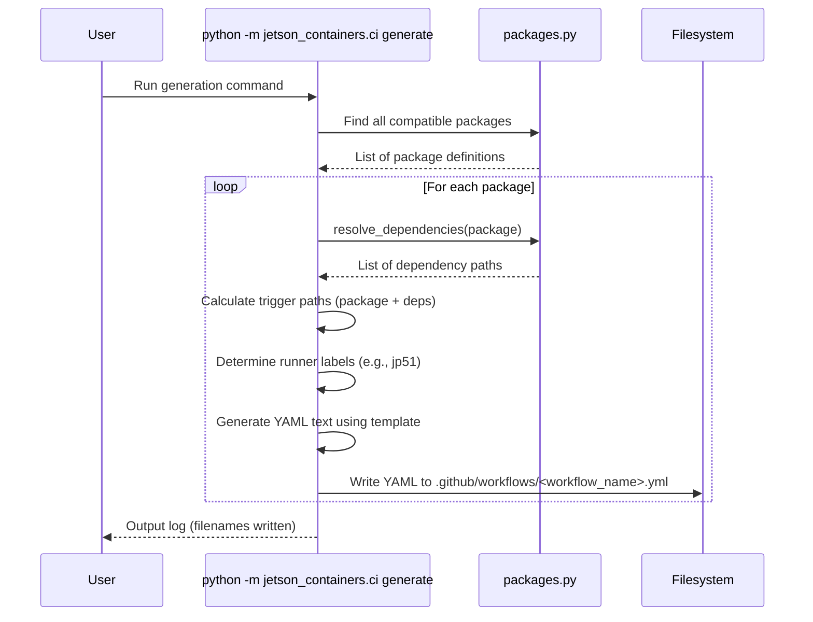

# Chapter 7: CI/CD Workflow Generation

In [Chapter 6: Documentation Generator](06_documentation_generator_.md), we saw how the project automatically creates helpful README files by pulling information directly from the package definitions and other sources. This keeps the documentation accurate and up-to-date.

Now, let's look at another layer of automation: ensuring that the software itself is consistently built and tested. How can we automatically check that changes to the code don't break anything? And how can we automate the process of building container images whenever the code is updated?

This is where **CI/CD Workflow Generation** comes in.

## Motivation: Automated Assembly Line and Quality Control

Imagine our LEGO project again. We have our bricks ([Chapter 2: Package Definition](02_package_definition_.md)), instructions ([Chapter 3: Package Configuration](03_package_configuration_.md)), a master builder ([Chapter 5: Container Build System](05_container_build_system_.md)), and even an automatic label maker ([Chapter 6: Documentation Generator](06_documentation_generator_.md)).

What if we wanted to set up a fully automated factory? Every time someone designs a new LEGO piece (makes a code change), we want an assembly line to automatically:
1.  Grab the new design and all the pieces it depends on.
2.  Build the final model using the standard process.
3.  Run some quality checks (tests) to make sure the new piece didn't cause problems.
4.  Maybe even package the final model and put it on the shelf (publish the container image).

This automated process is called **Continuous Integration and Continuous Delivery (CI/CD)**. It helps ensure that software is always in a working state and can be delivered reliably.

**The Problem:** Manually setting up and maintaining the instructions (workflows) for this automated factory for *every single package* in `jetson-containers` would be incredibly time-consuming and error-prone. Each package might have different dependencies and requirements. How can we automatically create these CI/CD instructions?

**The Solution:** The CI/CD Workflow Generator! It's a tool within `jetson-containers` that acts like the engineer designing the blueprints for our automated factory. It automatically generates the necessary configuration files (GitHub Actions workflows) based on the package definitions.

## What is CI/CD Workflow Generation?

This component is essentially a script (`jetson_containers/ci.py`) that reads the details of each software package and automatically writes the corresponding GitHub Actions workflow file (`.github/workflows/*.yml`).

Think of it like this:
*   **Package Definition:** Tells us *what* to build and its dependencies.
*   **CI/CD Workflow File (`.yml`):** Tells the automated factory (GitHub Actions) *how* and *when* to build and test that package.
*   **Workflow Generator (`ci.py`):** Automatically creates the workflow file based on the package definition.

These generated workflow files define automated jobs that typically run whenever changes are pushed to the project's code repository on GitHub.

## Key Concepts of Generated Workflows

The generator creates YAML files (like `.github/workflows/pytorch_jp51.yml`) that GitHub Actions understands. A typical generated workflow file includes:

1.  **Name (`name`, `run-name`):** Identifies the workflow (e.g., `pytorch_jp51`, "Build pytorch (JetPack 5.1)").
2.  **Triggers (`on`):** Specifies *when* the workflow should run. Usually:
    *   `workflow_dispatch`: Allows manual triggering from the GitHub website.
    *   `push`: Triggers automatically when changes are pushed to specific branches (like `dev`) *and* affect files relevant to the package or its dependencies. The generator automatically calculates these relevant file paths!
3.  **Jobs:** Defines the tasks to be performed. Typically, there's one main job:
    *   **Runner (`runs-on`):** Specifies *where* the job should run. Crucially, it uses labels generated based on [Chapter 4: L4T Version Awareness](04_l4t_version_awareness_.md) (e.g., `[self-hosted, jetson, jp51]`) to ensure the build happens on a compatible Jetson device.
    *   **Steps:** A sequence of commands to execute:
        *   `checkout`: Downloads the project code onto the runner machine.
        *   `build`: Runs the actual build command, often using the `build.sh` script (which internally calls `jetson-containers build`) or directly `jetson-containers build`. It might also include `--push=dustynv` to automatically push the built image to a container registry like Docker Hub if the build is successful.

## Using the Generator: Creating Workflows

Like the [Documentation Generator](06_documentation_generator_.md), you usually don't need to run this manually. The project maintainers use it to keep the workflows synchronized with the package definitions.

If you were to run it, the command would look something like this (executed from the project's root directory):

```bash
# Generate workflows for all packages compatible with the current system
python3 -m jetson_containers.ci generate

# Generate workflow for a specific package (e.g., pytorch)
# python3 -m jetson_containers.ci generate pytorch
```

This command scans the packages, checks their compatibility with the current JetPack version, and creates or updates the corresponding `.yml` files in the `.github/workflows/` directory.

**Example Output Snippet (Simplified `.github/workflows/pytorch_jp51.yml`):**

```yaml
# Auto-generated by jetson_containers/ci.py

name: "pytorch_jp51" # Unique workflow name
run-name: "Build pytorch (JetPack 5.1)" # Display name

on:
  workflow_dispatch: {} # Allow manual trigger
  push:
    branches:
      - 'dev' # Trigger on pushes to dev branch
    paths: # Only trigger if these files change:
      - '.github/workflows/pytorch_jp51.yml' # The workflow file itself
      - 'packages/pytorch/*' # Files in the pytorch package dir
      - '!packages/pytorch/README.md' # Exclude docs
      # --- Also includes paths for dependencies (cuda, cudnn, etc.) ---
      - 'packages/cuda/cuda/*'
      - '!packages/cuda/cuda/README.md'
      - 'packages/cudnn/*'
      - '!packages/cudnn/README.md'
      # ... and so on for all dependencies ...

jobs:
  pytorch_jp51: # Job ID
    # Run on a self-hosted Jetson runner matching JetPack 5.1 tags
    runs-on: [self-hosted, jetson, jp51]
    steps:
      # Step 1: Check OS release
      - run: |
         cat /etc/nv_tegra_release

      # Step 2: Checkout the code for the specific commit
      - name: "Checkout ${{ github.repository }} SHA=${{ github.sha }}"
        run: |
         # Commands to clone/fetch the repository and checkout the correct commit
         # ... git commands ...

      # Step 3: Run the build script (which uses jetson-containers build)
      #         and push the image to 'dustynv' registry if successful
      - run: ./build.sh --name=runner/ --push=dustynv pytorch
```

**Explanation of Key Generated Parts:**

*   **`on.push.paths`**: The generator automatically determines all relevant file paths. If you change code in `pytorch`, this workflow runs. Crucially, if you change code in `cuda` (which `pytorch` depends on), this `pytorch` workflow *also* runs, ensuring dependent packages are rebuilt and tested.
*   **`runs-on`**: Uses tags like `jp51` derived from the L4T version ([Chapter 4: L4T Version Awareness](04_l4t_version_awareness_.md)) to ensure the build runs on hardware with the correct JetPack version installed.
*   **`run: ./build.sh ... pytorch`**: Executes the build for the specific package (`pytorch` in this case), potentially pushing the result to Docker Hub (`--push=dustynv`).

By automatically generating these files, the project ensures that the CI/CD process is always correctly configured for every package and its dependencies.

## Under the Hood: How Workflows are Generated

The magic happens inside the `jetson_containers/ci.py` script, primarily in the `generate_workflow` function.

1.  **Package Discovery:** The script starts by finding package definitions using functions from `jetson_containers/packages.py`, just like the build system and documentation generator.
2.  **Compatibility Check:** It checks the package's `requires` metadata against the current system's L4T version ([Chapter 4: L4T Version Awareness](04_l4t_version_awareness_.md)). It only generates workflows for compatible packages.
3.  **Dependency Resolution:** It uses `resolve_dependencies` from `packages.py` to find all direct and indirect dependencies of the package.
4.  **Path Calculation:** It calculates the list of file paths for the `on.push.paths` trigger. This includes the path to the package itself and the paths to all its dependencies (excluding documentation files).
5.  **Runner Label Generation:** It determines the appropriate `runs-on` labels based on the current JetPack version (e.g., `jp51`).
6.  **YAML Generation:** It constructs the YAML text using Python f-strings or templating, inserting the package name, calculated paths, runner labels, and standard build commands.
7.  **File Writing:** It writes the generated YAML content to a file named appropriately (e.g., `pytorch_jp51.yml`) within the `.github/workflows/` directory.

**Simplified Sequence Diagram:**



**Conceptual Code Snippet (from `ci.py`):**

This is a *highly simplified* look at the `generate_workflow` function:

```python
# Simplified concept from jetson_containers/ci.py

from jetson_containers import (find_package, resolve_dependencies,
                               L4T_VERSION, JETPACK_VERSION)
import os

def generate_workflow(package, root, simulate=False):
    # 'package' is the dictionary definition for one package

    name = package['name']
    # Generate workflow name based on package and JetPack version
    workflow_name = f"{name}_jp{JETPACK_VERSION.major}{JETPACK_VERSION.minor}".replace(':','-').replace('.','')
    filename = os.path.join(root, '.github/workflows', f"{workflow_name}.yml")

    # --- Calculate trigger paths ---
    on_paths = []
    on_paths.append(f".github/workflows/{workflow_name}.yml") # Workflow itself
    # Add package path (excluding docs)
    on_paths.append(os.path.join(package['path'].replace(root+'/',''), '*'))
    on_paths.append(f"!{os.path.join(package['path'].replace(root+'/',''), 'README.md')}")

    # Add paths for all dependencies (excluding docs)
    depends = resolve_dependencies(package.get('depends', []))
    for depend in depends:
        depend_pkg = find_package(depend) # Find the dependency's definition
        on_paths.append(os.path.join(depend_pkg['path'].replace(root+'/',''), '*'))
        on_paths.append(f"!{os.path.join(depend_pkg['path'].replace(root+'/',''), 'README.md')}")

    # --- Start generating YAML text ---
    txt = f"name: \"{workflow_name}\"\n"
    txt += f"run-name: \"Build {name} (JetPack {JETPACK_VERSION.major}.{JETPACK_VERSION.minor})\"\n"
    txt += "on:\n"
    txt += "  workflow_dispatch: {}\n"
    txt += "  push:\n"
    txt += "    branches:\n      - 'dev'\n"
    txt += "    paths:\n"
    for on_path in on_paths:
        txt += f"      - '{on_path}'\n"

    # --- Define the job ---
    txt += "jobs:\n"
    txt += f"  {workflow_name}:\n"
    # Use L4T/JetPack version for runner tags
    txt += f"    runs-on: [self-hosted, jetson, jp{JETPACK_VERSION.major}{JETPACK_VERSION.minor}]\n"
    txt += "    steps:\n"
    # Add standard checkout and build steps
    txt += "      - run: |\n         cat /etc/nv_tegra_release \n" # Check OS
    txt += "      - name: \"Checkout ...\"\n        run: |\n         # git commands ...\n"
    # Use build.sh (which wraps jetson-containers build) and push to dustynv
    txt += f"      - run: ./build.sh --name=runner/ --push=dustynv {package['name']}\n"

    print(f"Generating workflow: {filename}")
    # --- Write the file ---
    # if not simulate:
    #     with open(filename, 'w') as file:
    #         file.write(txt)
```

This generator acts as a blueprint designer, translating the package structure and dependencies into the specific instructions needed by the GitHub Actions automated factory. The build status badges shown in the [Documentation Generator](06_documentation_generator_.md) are then generated by linking to these specific workflow files on GitHub.

## Conclusion

You've learned about the **CI/CD Workflow Generator** (`jetson_containers/ci.py`), the component that automates the creation of instructions for our automated software factory (GitHub Actions).

By reading package definitions ([Chapter 2: Package Definition](02_package_definition_.md)), dependencies, and L4T requirements ([Chapter 4: L4T Version Awareness](04_l4t_version_awareness_.md)), it generates `.github/workflows/*.yml` files that define how and when each package should be automatically built and tested. This ensures consistency, accuracy, and significantly reduces the manual effort needed to maintain the project's CI/CD pipeline.

This concludes our tour of the main components of the `jetson-containers` project! We hope this gives you a solid understanding of how the different pieces work together to make building and running containers on Jetson easier and more reliable.

---

Generated by [AI Codebase Knowledge Builder](https://github.com/The-Pocket/Tutorial-Codebase-Knowledge)