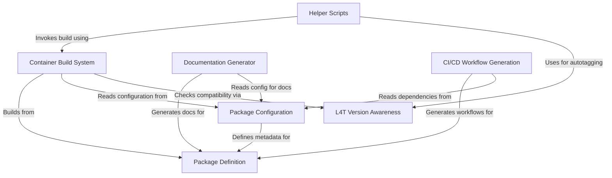

# Jetson Containers Tutorial

Welcome to the Jetson Containers tutorial! This guide will help you understand and work with Jetson Containers.

## Table of Contents

1. [Helper Scripts & Jetson Containers Command](01_helper_scripts___jetson_containers__command__.md)
2. [Package Definition](02_package_definition_.md)
3. [Package Configuration](03_package_configuration_.md)
4. [L4T Version Awareness](04_l4t_version_awareness_.md)
5. [Container Build System](05_container_build_system_.md)
6. [Documentation Generator](06_documentation_generator_.md)
7. [CI/CD Workflow Generation](07_ci_cd_workflow_generation_.md)

`jetson-containers` provides a **modular system** for building and managing Docker containers tailored for *NVIDIA Jetson* platforms.
It simplifies installing complex AI/ML software like PyTorch, TensorFlow, and ROS by defining them as independent *packages*.
The system automatically handles dependencies and ensures **compatibility** with your specific Jetson *L4T version* (JetPack).
Helper scripts provide easy commands like `jetson-containers build` and `jetson-containers run` to manage the container lifecycle.

**Source Repository:** [https://github.com/dusty-nv/jetson-containers/tree/master](https://github.com/dusty-nv/jetson-containers/tree/master)

## Chapters

1. [Helper Scripts (`jetson-containers` command)](01_helper_scripts___jetson_containers__command__.md)
2. [Package Definition](02_package_definition_.md)
3. [Package Configuration](03_package_configuration_.md)
4. [L4T Version Awareness](04_l4t_version_awareness_.md)
5. [Container Build System](05_container_build_system_.md)
6. [Documentation Generator](06_documentation_generator_.md)
7. [CI/CD Workflow Generation](07_ci_cd_workflow_generation_.md)

---

Generated by [AI Codebase Knowledge Builder](https://github.com/The-Pocket/Tutorial-Codebase-Knowledge)